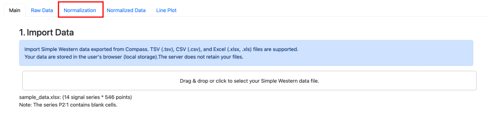
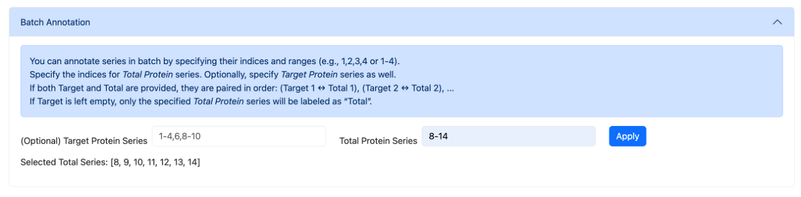
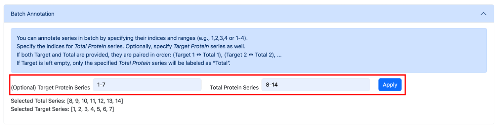
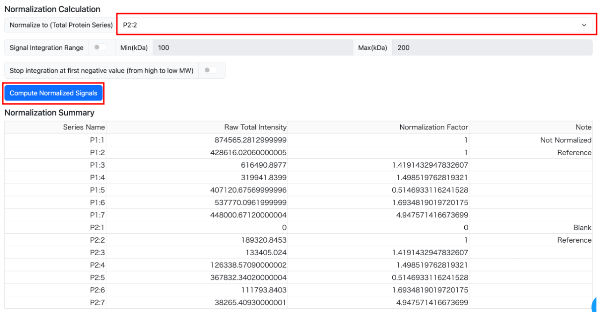

# Drawing with Total Protein Normalization

## Overview
The workflow for Total Protein Normalization (TPN) consists of the following steps:

1. **Annotating each data series:**  
   Add annotations to each series.  
   First, specify whether each series is a `total` (Total Protein) or `target` (Target Protein) series, and then map each `target` series to its corresponding `total` series.

2. **Calculating and applying scaling factors:**  
   Compute scaling factors for all series so that the total signal of the `total` series becomes equal across samples.  
   Apply these factors to obtain the corrected signal values for each series.

3. Generating the final plot

---

## Operation

### Loading the Signal Data
Load the signal data file from the main panel.

Once the file is loaded, move to the **[Normalization]** tab.  
All normalization-related configurations and calculations are performed here.

!!! example
    Load the sample data file.

---

### Annotating the Signal Series
In the **Series Mapping for Normalization** section, enter the metadata for each imported data series.

For TPN, the following information is required:

* **type column:** The type of each series  
  (Target Protein / Total Protein)
* **Associated Series column:** The Total Protein series corresponding to each Target Protein series

!!! example
    In this sample, "P1:1"–"P1:7" are Target Protein series and "P2:1"–"P2:7" are Total Protein series.  
    Since these pairs correspond in order, the table is configured as follows:

    

!!! note
    If the `Associated Series` cell is left blank for a target protein series, that series will be excluded from normalization.  
    This is useful for series like molecular weight markers, which have no corresponding total-protein series.

---

### Faster Method: Batch Assignment by Index
If you have many series, you can use the **Batch Annotation** menu to configure them more efficiently.

The two input fields have the following roles:

* **Left field:** Specify multiple Total Protein series at once  
* **Right field:** Specify the Target Protein series corresponding to those Total Protein series

To mark several Total Protein series, enter their index numbers (displayed on the left side of the "Series Configuration" table) in the left input field.  
You may enter **comma-separated values** or a **range** such as `8-14`.

!!! example
    **Example 1: Marking series 8 through 14 as Total Protein**

    Enter `8,9,10,11,12,13,14` or `8-14` into the left input field.  
    

You can also assign the corresponding Target Protein series in bulk.  
In the right input field, enter index numbers in the **same count and order** as the Total Protein series specified on the left.

!!! example
    **Example 2: Setting series 8–14 as Total Protein and mapping them to target series 1–7**

    Enter `1-7` in the left field and `8-14` in the right field, then press Enter.  
    

---

### Running the Normalization Calculation
After configuring the relationships among the series, proceed to run the normalization calculation.  
The available options are:

* **Total Signal: Normalize to (required):**  
  Select the series to which the total signal will be normalized.

* **Set Signal Calculation Range (optional):**  
  Specify the molecular-weight range used for the normalization calculation.  
  Signals outside this range will be excluded.

* **Stop integration at first negative value:**  
  When enabled, the integration (summation) of each series stops at the first negative signal value encountered on the low–molecular-weight side.

After setting the parameters, click **[Calculate Normalized Signal]** to run the computation.

Once the calculation completes, a **Summary** appears at the bottom of the page,  
and the results are displayed in the **[Normalized Data]** tab.

---

### Plotting the Data
After normalization is complete, return to the main control panel and select  
**`Plot Normalized Data by Total Proteins`** as the plotting mode.

All other drawing settings are the same as when plotting raw signal data.

