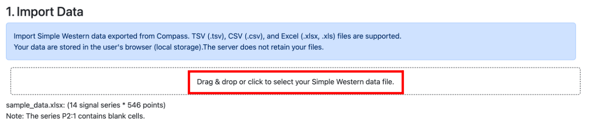

# Tutorial

This section explains the most basic procedure for generating band images.
No normalization or additional calculations are performed here; the program simply renders the image based on the raw signal intensity file you provide.

The basic workflow for image generation is as follows:

1. Loading the file  
2. Configuring the drawing data  
3. Generating the image

## 1. Loading the File
Load the signal-intensity file exported from Compass.  
Click the outlined box labeled `1. Import Data` to open the file explorer (or Finder on macOS), then select the file you wish to import.

## 2. Drawing Settings
Normally, you would configure lane settings and drawing options here.  
However, image generation is also possible with the default settings, so we will skip this step in this tutorial.  
(Without changing any settings, scroll down to the bottom of the screen.)

## 3. Generating the Image
At the bottom of the screen, you will find a button labeled `Generate`.  
Click this button to generate the band image.

## 4. Adjusting the Image
You can fine-tune the output image under the `Draw Settings` section.
